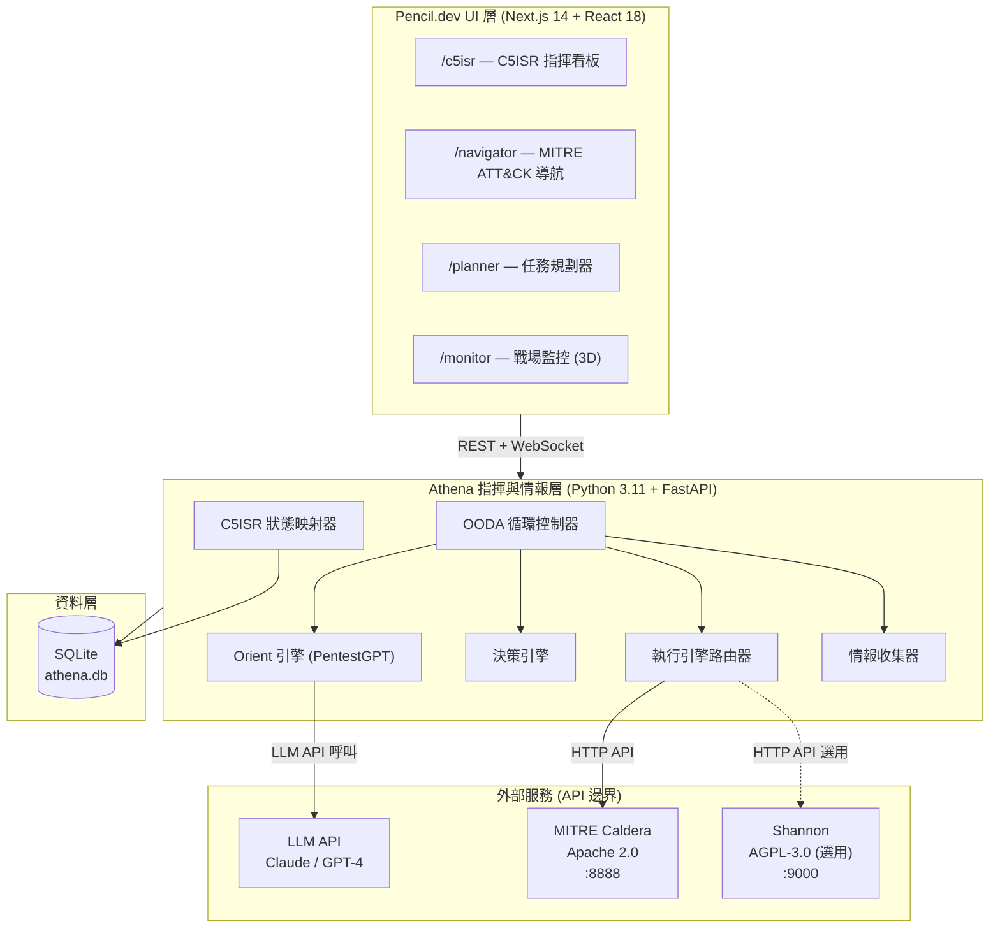
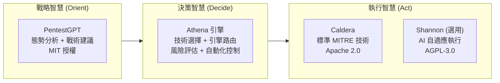
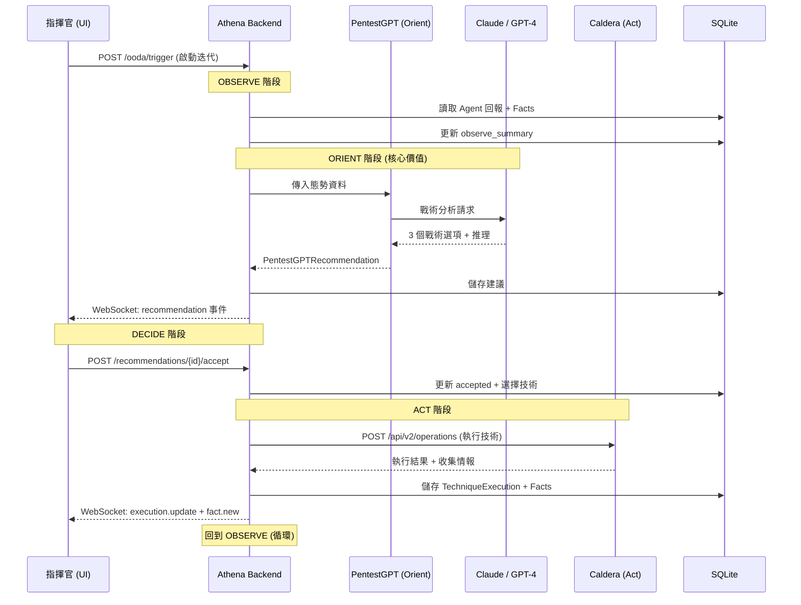
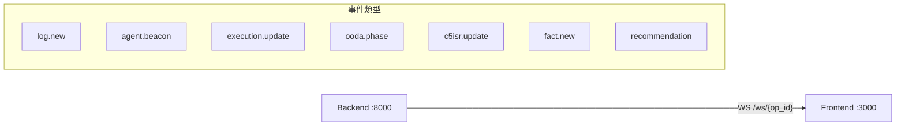
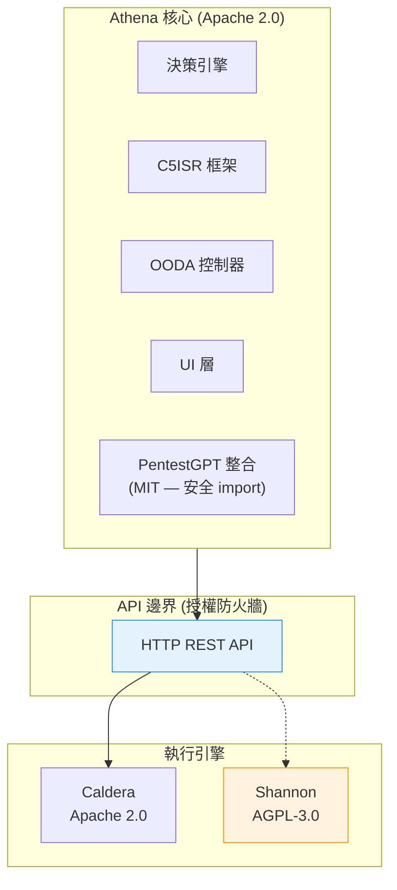

# Architecture — 系統架構文件

| 欄位 | 內容 |
|------|------|
| **專案** | Athena |
| **版本** | v0.1.0-poc |
| **最後更新** | 2026-02-26 |

---

## 系統概覽

Athena 是一套 AI 驅動的 C5ISR（Command, Control, Communications, Computers, Cyber, Intelligence, Surveillance, Reconnaissance）網路作戰指揮平台。核心職責為透過 OODA 循環（Observe → Orient → Decide → Act）編排 AI 情報分析（PentestGPT）與執行引擎（Caldera/Shannon），為資深紅隊指揮官提供戰略級決策支援。

系統邊界：Athena 不直接執行攻擊——它是指揮層，透過 API 指揮外部執行引擎。

---

## 架構圖

### 高層架構



### 三層智慧架構



---

## 服務清單

| 服務名稱 | 職責 | 技術棧 | Port | 容器 |
|----------|------|--------|------|------|
| backend | REST API + WebSocket + OODA 引擎 + AI 整合 | Python 3.11 / FastAPI / Pydantic | 8000 | athena-backend |
| frontend | 指揮官儀表板 UI（4 個畫面 + 3D 拓樸） | Next.js 14 / React 18 / Tailwind v4 | 3000 | athena-frontend |
| caldera | MITRE ATT&CK 技術執行引擎 | Python / MITRE 官方 | 8888 | 外部（獨立部署） |
| shannon | AI 自適應執行引擎（選用） | Python / Keygraph | 9000 | 外部（獨立部署） |

### 後端服務模組（Phase 5 實作）

| 模組 | 路徑 | 職責 |
|------|------|------|
| OODA Controller | `services/ooda_controller.py` | OODA 狀態機，驅動四階段循環 |
| Fact Collector | `services/fact_collector.py` | 標準化執行結果為情報 |
| Orient Engine | `services/orient_engine.py` | LLM 戰術分析（Claude/GPT-4，受 PentestGPT 啟發） |
| Decision Engine | `services/decision_engine.py` | 基於 AI + 風險的技術選擇 |
| Engine Router | `services/engine_router.py` | 路由至 Caldera 或 Shannon |
| C5ISR Mapper | `services/c5isr_mapper.py` | 聚合各來源的 C5ISR 域健康度 |
| Mock Caldera | `clients/mock_caldera_client.py` | Caldera Mock 客戶端（POC 預設） |
| Demo Runner | `seed/demo_runner.py` | 6 步自動 OODA 循環展示 |

### Docker 部署拓樸（Phase 6 實作）

```
docker-compose.yml
├── backend (python:3.11-slim)  → :8000
│   ├── healthcheck: httpx GET /api/health
│   └── volume: backend-data (SQLite)
└── frontend (node:20-alpine, multi-stage)  → :3000
    └── depends_on: backend (service_healthy)
```

WSL2 使用者：建立 `docker-compose.override.yml`（已在 `.gitignore`）覆寫 port 綁定。

---

## 資料流

### OODA 循環主流程



### WebSocket 即時事件



---

## 外部依賴

| 依賴 | 用途 | 版本/模型 | 授權 | 整合方式 | 替代方案 |
|------|------|----------|------|---------|---------|
| MITRE Caldera | 標準 MITRE ATT&CK 技術執行 | 4.x | Apache 2.0 | REST API | —（核心） |
| Shannon | AI 自適應攻擊執行（選用） | latest | AGPL-3.0 | REST API（隔離） | 僅用 Caldera |
| PentestGPT | OODA Orient 階段情報分析 | latest | MIT | Python import | —（核心） |
| Claude API | 主要 LLM 後端 | claude-opus-4-20250514 | 商業 API | HTTP API | GPT-4 |
| GPT-4 API | 備用 LLM 後端 | gpt-4-turbo-preview | 商業 API | HTTP API | Claude |
| react-force-graph-3d | 3D 網路拓樸視覺化 | latest | MIT | npm 套件 | D3.js (2D) |
| Three.js | WebGL 3D 渲染引擎 | latest | MIT | 透過 r-f-g-3d | — |

---

## 安全邊界

### 授權隔離架構



### POC 安全態勢

- API 金鑰透過 `.env` 管理（已加入 `.gitignore`）
- 僅本機部署（`localhost`），不暴露至公開網路
- 最低限度身份驗證（POC 可接受）
- Shannon 嚴禁程式碼 import——僅 HTTP API 呼叫

### 禁止操作

- 將機密（API 金鑰、憑證）提交到 Git
- Import Shannon 原始碼或靜態連結
- 以 root 身份運行容器
- 暴露服務至公開網路

---

## 已知技術債

- [ ] SQLite 需遷移至 PostgreSQL（Phase 8 正式版）
- [ ] 3D 拓樸元件需 `dynamic import` + `"use client"`（Next.js SSR 限制）
- [x] LLM API 離線測試需 mock 層（Phase 5 已建立 — `MOCK_LLM=True`）
- [x] Caldera mock 客戶端（Phase 5 已建立 — `mock_caldera_client.py`）
- [ ] WebSocket 無 Redis pub/sub 背壓機制（Phase 8 正式版）
- [ ] 身份驗證與 RBAC 尚未實作（Phase 8）

---

## 關聯 ADR

| ADR | 決策 | 狀態 |
|-----|------|------|
| [ADR-001](adr/ADR-001-initial-technology-stack.md) | 初始技術棧選型 | `Accepted` |
| [ADR-002](adr/ADR-002-monorepo-project-structure.md) | Monorepo 專案結構 | `Accepted` |
| [ADR-003](adr/ADR-003-ooda-loop-engine-architecture.md) | OODA 循環引擎架構（六服務分層） | `Accepted` |
| [ADR-004](adr/ADR-004-semi-auto-with-manual-override.md) | 半自動化模式與手動覆寫 | `Accepted` |
| [ADR-005](adr/ADR-005-pentestgpt-orient-engine.md) | PentestGPT 整合為 Orient 引擎 | `Accepted` |
| [ADR-006](adr/ADR-006-execution-engine-abstraction-and-license-isolation.md) | 執行引擎抽象層與授權隔離 | `Accepted` |
| [ADR-007](adr/ADR-007-websocket-realtime-communication.md) | WebSocket 即時通訊架構 | `Accepted` |
| [ADR-008](adr/ADR-008-sqlite-data-schema-design.md) | SQLite 資料模型與 Schema 設計 | `Accepted` |
| [ADR-009](adr/ADR-009-frontend-component-architecture.md) | 前端元件架構與設計系統整合 | `Accepted` |
| [ADR-010](adr/ADR-010-docker-compose-deployment.md) | Docker Compose 部署拓樸 | `Accepted` |
| [ADR-011](adr/ADR-011-no-auth-for-poc.md) | POC 階段不實作身份驗證 | `Accepted` |
| [ADR-012](adr/ADR-012-c5isr-framework-mapping.md) | C5ISR 框架映射架構 | `Accepted` |

---

## 詳細文件索引

- [資料架構](architecture/data-architecture.md) — 13 Enum、12 Model、SQLite Schema、35+ REST API、種子資料
- [專案結構](architecture/project-structure.md) — Monorepo 目錄佈局、各層職責、開發優先順序
