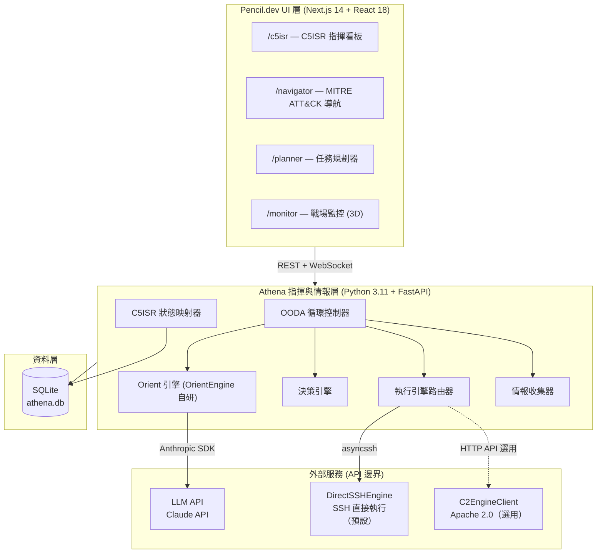
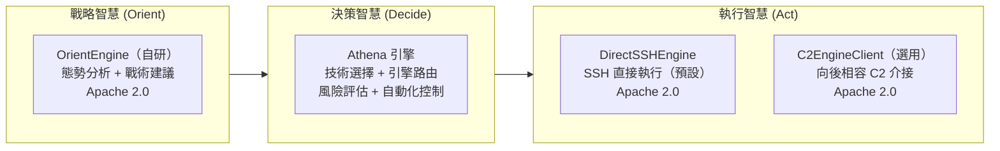
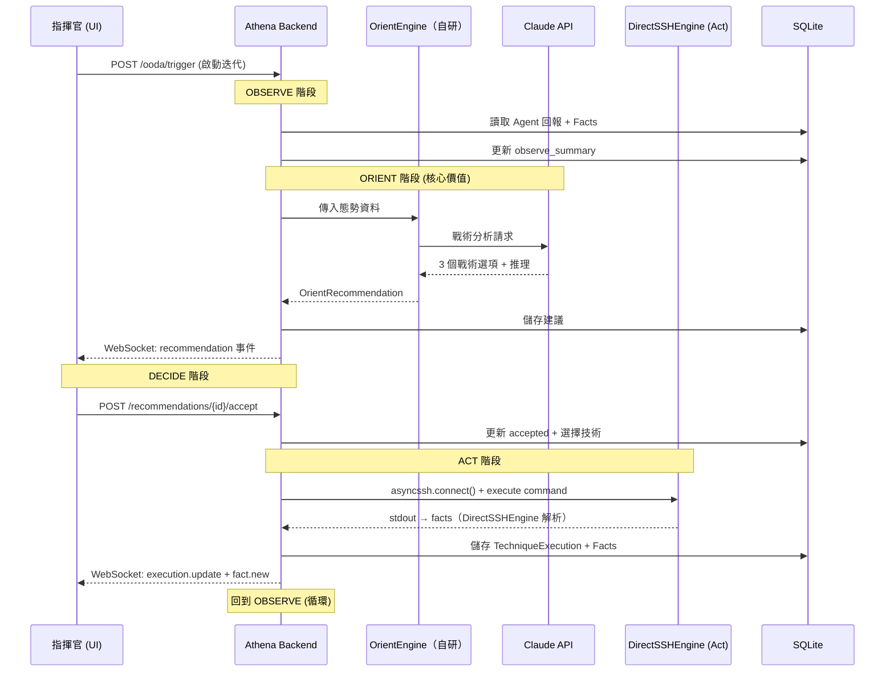
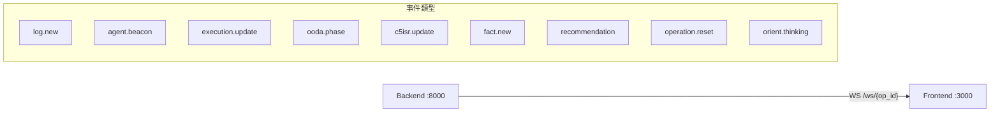
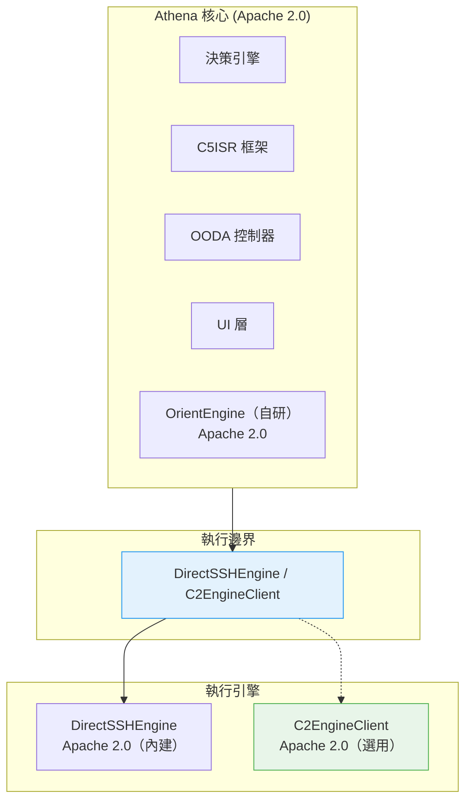

# Architecture — 系統架構文件

| 欄位 | 內容 |
|------|------|
| **專案** | Athena |
| **版本** | v0.3.0 |
| **最後更新** | 2026-03-04 |

---

## 核心展示目標

Athena 的核心目標是展示「**輸入任意 IP 或域名 → 全自動 Kill Chain**」：

```
輸入 IP/域名 → Recon → Initial Access → Agent 建立 → OODA 自動循環
   (任意目標)    (nmap)   (SSH/exploit)  (C2/DirectSSH) (MITRE ATT&CK)
```

**設計原則（所有未來開發必須遵守）：**
- Credential 清單、port 掃描範圍、exploit 選擇等**必須基於業界通用標準**，不得針對特定靶機硬編碼
- 任何 target（IP 或可解析域名）都應能進入完整 Kill Chain，無需修改程式碼
- 前端 UI 的 target 輸入欄位應同時支援 IPv4、IPv6 和域名

---

## 系統概覽

Athena 是一套 AI 驅動的 C5ISR（Command, Control, Communications, Computers, Cyber, Intelligence, Surveillance, Reconnaissance）網路作戰指揮平台。核心職責為透過 OODA 循環（Observe → Orient → Decide → Act）編排 AI 情報分析（OrientEngine 自研）與執行引擎（DirectSSHEngine 預設 / CalderaClient 選用），為資深紅隊指揮官提供戰略級決策支援。

系統邊界：Athena 不直接執行攻擊——它是指揮層，透過 API 指揮外部執行引擎。

---

## 架構圖

### 高層架構


```mermaid
graph TD
    subgraph UI["Pencil.dev UI 層 (Next.js 14 + React 18)"]
        C5ISR["/c5isr — C5ISR 指揮看板"]
        NAV["/navigator — MITRE ATT&CK 導航"]
        PLAN["/planner — 任務規劃器"]
        MON["/monitor — 戰場監控 (3D)"]
    end

    subgraph Core["Athena 指揮與情報層 (Python 3.11 + FastAPI)"]
        OODA["OODA 循環控制器"]
        ORIENT["Orient 引擎 (OrientEngine 自研)"]
        DECIDE["決策引擎"]
        ROUTER["執行引擎路由器"]
        C5MAP["C5ISR 狀態映射器"]
        FACTS["情報收集器"]
    end

    subgraph DB["資料層"]
        SQLITE[("SQLite\nathena.db")]
    end

    subgraph External["外部服務 (API 邊界)"]
        LLM["LLM API\nClaude API"]
        CAL["DirectSSHEngine\nSSH 直接執行\n（預設）"]
        SHA["C2EngineClient\nApache 2.0（選用）"]
    end

    UI -->|REST + WebSocket| Core
    OODA --> FACTS
    OODA --> ORIENT
    OODA --> DECIDE
    OODA --> ROUTER
    ORIENT -->|Anthropic SDK| LLM
    ROUTER -->|asyncssh| CAL
    ROUTER -.->|HTTP API 選用| SHA
    Core --> SQLITE
    C5MAP --> SQLITE
```

### 三層智慧架構


```mermaid
graph LR
    subgraph Strategic["戰略智慧 (Orient)"]
        PG["OrientEngine（自研）\n態勢分析 + 戰術建議\nApache 2.0"]
    end

    subgraph Decision["決策智慧 (Decide)"]
        AE["Athena 引擎\n技術選擇 + 引擎路由\n風險評估 + 自動化控制"]
    end

    subgraph Execution["執行智慧 (Act)"]
        CD["DirectSSHEngine\nSSH 直接執行（預設）\nApache 2.0"]
        SN["C2EngineClient（選用）\n向後相容 C2 介接\nApache 2.0"]
    end

    Strategic --> Decision --> Execution
```

---

## 服務清單

| 服務名稱 | 職責 | 技術棧 | Port | 容器 |
|----------|------|--------|------|------|
| backend | REST API + WebSocket + OODA 引擎 + AI 整合 | Python 3.11 / FastAPI / Pydantic | 8000 | athena-backend |
| frontend | 指揮官儀表板 UI（5 個畫面 + 3D 拓樸 + 情勢圖） | Next.js 14 / React 18 / Tailwind v4 | 3000 | athena-frontend |
| DirectSSHEngine | SSH 直接執行 MITRE techniques（預設引擎） | asyncssh / Python | 內建 | 無需獨立容器 |
| C2EngineClient | 向後相容 C2 執行（選用，EXECUTION_ENGINE=c2） | Python / REST API | 8888 | 外部（獨立部署，選用） |

### 後端服務模組（Phase 5 實作）

| 模組 | 路徑 | 職責 |
|------|------|------|
| OODA Controller | `services/ooda_controller.py` | OODA 狀態機，驅動四階段循環 |
| Fact Collector | `services/fact_collector.py` | 標準化執行結果為情報 |
| Orient Engine | `services/orient_engine.py` | LLM 戰術分析（自研 OrientEngine，直接呼叫 Claude API） |
| Decision Engine | `services/decision_engine.py` | 基於 AI + 風險的技術選擇 |
| Engine Router | `services/engine_router.py` | 路由至 DirectSSHEngine / C2EngineClient / Mock（三軌路由） |
| DirectSSH Engine | `clients/direct_ssh_client.py` | SSH 直接執行 MITRE techniques（預設引擎，ADR-017） |
| C5ISR Mapper | `services/c5isr_mapper.py` | 聚合各來源的 C5ISR 域健康度 |
| Mock C2 Engine | `clients/mock_c2_client.py` | C2 引擎 Mock 客戶端（EXECUTION_ENGINE=mock） |
| Demo Runner | `seed/demo_runner.py` | 6 步自動 OODA 循環展示 |
| Reports API | `routers/reports.py` | 作戰報告匯出（10 段落 JSON）；`/report/structured`（PentestReport JSON）、`/report/markdown` 下載（Phase A） |
| Report Generator | `services/report_generator.py` | 從 DB 組裝客戶可交付滲透測試報告：findings（按 CVSS 排序）、attack narrative、MITRE coverage（Phase A） |
| Admin API | `routers/admin.py` | 管理操作（Reset 作戰資料） |
| Recon Engine | `services/recon_engine.py` | nmap 掃描 → 結構化服務清單 + facts 寫入（Phase 12）；Step 8 CVE 關聯（Phase A） |
| Initial Access Engine | `services/initial_access_engine.py` | SSH credential 嘗試 + SSH agent 自動建立（Phase 12）；憑證鏈接（Phase A） |
| Recon API | `routers/recon.py` | POST `/recon/scan`、GET `/recon/status`（Phase 12）；POST `/osint/discover`（Phase A） |
| OSINT Engine | `services/osint_engine.py` | domain → 子網域枚舉（crt.sh + subfinder）→ DNS 解析 → Target 建立（Phase A） |
| Scope Validator | `services/scope_validator.py` | ROE 範圍驗證：IP/CIDR/domain/wildcard，時間視窗，向後相容（Phase A） |
| Vuln Lookup Service | `services/vuln_lookup.py` | NVD NIST API CVE 關聯 + SQLite 快取 → vuln.cve facts（Phase A） |
| Engagements API | `routers/engagements.py` | ROE CRUD + activate/suspend（Phase A） |
| Attack Path API | `routers/techniques.py` — `GET /attack-path` | Attack Path Timeline 資料（JOIN technique_executions + techniques + targets）（Phase B） |
| Tool Registry API | `routers/tools.py` | 工具/引擎 CRUD（list/get/create/patch/delete/check）— 6 endpoints（Phase G） |

### Docker 部署拓樸（Phase 6 實作）

```
docker-compose.yml
├── backend (python:3.11-slim)  → :8000
│   ├── healthcheck: httpx GET /api/health
│   └── volume: backend-data (SQLite)
└── frontend (node:20-alpine, multi-stage)  → :3000
    └── depends_on: backend (service_healthy)
```

WSL2 使用者：建立 `docker-compose.override.yml`（已在 `.gitignore`）覆寫 port 綁定。

---

## 資料流

### OODA 循環主流程


```mermaid
sequenceDiagram
    participant CMD as 指揮官 (UI)
    participant BE as Athena Backend
    participant PG as OrientEngine（自研）
    participant LLM as Claude API
    participant CAL as DirectSSHEngine (Act)
    participant DB as SQLite

    CMD->>BE: POST /ooda/trigger (啟動迭代)

    Note over BE: OBSERVE 階段
    BE->>DB: 讀取 Agent 回報 + Facts
    BE->>DB: 更新 observe_summary

    Note over BE,LLM: ORIENT 階段 (核心價值)
    BE->>PG: 傳入態勢資料
    PG->>LLM: 戰術分析請求
    LLM-->>PG: 3 個戰術選項 + 推理
    PG-->>BE: OrientRecommendation
    BE->>DB: 儲存建議
    BE-->>CMD: WebSocket: recommendation 事件

    Note over CMD,BE: DECIDE 階段
    CMD->>BE: POST /recommendations/{id}/accept
    BE->>DB: 更新 accepted + 選擇技術

    Note over BE,CAL: ACT 階段
    BE->>CAL: asyncssh.connect() + execute command
    CAL-->>BE: stdout → facts（DirectSSHEngine 解析）
    BE->>DB: 儲存 TechniqueExecution + Facts
    BE-->>CMD: WebSocket: execution.update + fact.new

    Note over BE: 回到 OBSERVE (循環)
```

### WebSocket 即時事件


```mermaid
graph LR
    BE["Backend :8000"] -->|"WS /ws/{op_id}"| FE["Frontend :3000"]

    subgraph Events["事件類型"]
        E1["log.new"]
        E2["agent.beacon"]
        E3["execution.update"]
        E4["ooda.phase"]
        E5["c5isr.update"]
        E6["fact.new"]
        E7["recommendation"]
        E8["operation.reset"]
        E9["orient.thinking"]
    end
```

---

## 外部依賴

| 依賴 | 用途 | 版本/模型 | 授權 | 整合方式 | 替代方案 |
|------|------|----------|------|---------|---------|
| DirectSSHEngine | 預設 MITRE 技術執行引擎（自研） | asyncssh 2.x | Apache 2.0 | asyncssh 直接執行 | C2EngineClient（選用） |
| C2EngineClient | 向後相容 C2 執行（選用） | 4.x | Apache 2.0 | REST API | DirectSSHEngine（預設） |
| Claude API | 主要 LLM 後端（OrientEngine 使用） | claude-sonnet-4-6 | 商業 API | Anthropic Python SDK | OAuth（claude login） |
| react-force-graph-3d | 3D 網路拓樸視覺化 | latest | MIT | npm 套件 | D3.js (2D) |
| Three.js | WebGL 3D 渲染引擎 | latest | MIT | 透過 r-f-g-3d | — |

---

## 安全邊界

### 授權隔離架構


```mermaid
graph TD
    subgraph Safe["Athena 核心 (Apache 2.0)"]
        A["決策引擎"]
        B["C5ISR 框架"]
        C["OODA 控制器"]
        D["UI 層"]
        E["OrientEngine（自研）\nApache 2.0"]
    end

    subgraph API_Boundary["執行邊界"]
        F["DirectSSHEngine / C2EngineClient"]
    end

    subgraph Engines["執行引擎"]
        G["DirectSSHEngine\nApache 2.0（內建）"]
        H["C2EngineClient\nApache 2.0（選用）"]
    end

    Safe --> F --> G
    F -.-> H

    style H fill:#e8f5e9,stroke:#4caf50
    style F fill:#e3f2fd,stroke:#2196f3
```

### POC 安全態勢

- API 金鑰透過 `.env` 管理（已加入 `.gitignore`）
- 僅本機部署（`localhost`），不暴露至公開網路
- 最低限度身份驗證（POC 可接受）
- C2EngineClient 嚴禁程式碼 import——僅 HTTP API 呼叫

### 禁止操作

- 將機密（API 金鑰、憑證）提交到 Git
- Import C2EngineClient 原始碼或靜態連結
- 以 root 身份運行容器
- 暴露服務至公開網路

---

## 已知技術債

- [ ] SQLite 需遷移至 PostgreSQL（Phase 8 正式版）
- [ ] 3D 拓樸元件需 `dynamic import` + `"use client"`（Next.js SSR 限制）
- [x] LLM API 離線測試需 mock 層（Phase 5 已建立 — `MOCK_LLM=True`）
- [x] Mock C2 引擎客戶端（已建立 — `mock_c2_client.py`；原 mock_caldera_client.py Phase E 重命名）
- [ ] WebSocket 無 Redis pub/sub 背壓機制（Phase 8 正式版）
- [ ] 身份驗證與 RBAC 尚未實作（Phase 8）
- [x] Phase 11 新模組測試已補齊（24 tests：backend 10 + frontend 14）
- [x] Phase 12 Recon + Initial Access 引擎（nmap + asyncssh），7 個新後端測試
- [x] Phase 13 前端 UI Recon 支援（AddTargetModal、ReconResultModal、HostNodeCard SCAN）
- [x] Phase A ROE/Scope 驗證（ScopeValidator + engagements API）
- [x] Phase A OSINT 引擎（crt.sh + subfinder + dnspython）
- [x] Phase A CVE 關聯（NVD API + vuln_cache，89 tests）
- [x] Phase A 憑證鏈接（_load_harvested_creds + OrientEngine 提示詞）
- [x] Phase A 結構化報告（ReportGenerator + `/report/structured` + `/report/markdown`，95 tests）
- [x] Phase B DirectSSHEngine + Attack Path Timeline（ADR-017、ADR-018、SPEC-021）
- [x] Phase F UX 精修 + LLM 監控 + Web Terminal + Topology Tab（SPEC-024）
- [x] Phase G Tool Registry 管理系統 — CRUD API + 前端 /tools 頁面（SPEC-025）
- [x] Phase G 動態攻擊情勢圖 — SVG Kill Chain + OODA Ring + C5ISR Health Bar（SPEC-026）
- [ ] Phase C Windows 執行引擎（WinRM/SMB）— DirectSSHEngine 目前僅支援 Linux/SSH
- [ ] Phase C Metasploit RPC 整合（ADR-016 草稿）
- [ ] Phase C Web 應用掃描（nuclei 整合）
- [ ] Phase C JWT 身份驗證 + RBAC（Phase 8 計畫）
- [ ] Tool Registry 與 engine_router 動態整合（目前僅管理用途，SPEC-016 Planned）

---

## 關聯 ADR

| ADR | 決策 | 狀態 |
|-----|------|------|
| [ADR-001](adr/ADR-001-initial-technology-stack.md) | 初始技術棧選型 | `Accepted` |
| [ADR-002](adr/ADR-002-monorepo-project-structure.md) | Monorepo 專案結構 | `Accepted` |
| [ADR-003](adr/ADR-003-ooda-loop-engine-architecture.md) | OODA 循環引擎架構（六服務分層） | `Accepted` |
| [ADR-004](adr/ADR-004-semi-auto-with-manual-override.md) | 半自動化模式與手動覆寫 | `Accepted` |
| [ADR-005](adr/ADR-005-pentestgpt-orient-engine.md) | PentestGPT 整合為 Orient 引擎 | `Accepted` |
| [ADR-006](adr/ADR-006-execution-engine-abstraction-and-license-isolation.md) | 執行引擎抽象層與授權隔離 | `Accepted` |
| [ADR-007](adr/ADR-007-websocket-realtime-communication.md) | WebSocket 即時通訊架構 | `Accepted` |
| [ADR-008](adr/ADR-008-sqlite-data-schema-design.md) | SQLite 資料模型與 Schema 設計 | `Accepted` |
| [ADR-009](adr/ADR-009-frontend-component-architecture.md) | 前端元件架構與設計系統整合 | `Accepted` |
| [ADR-010](adr/ADR-010-docker-compose-deployment.md) | Docker Compose 部署拓樸 | `Accepted` |
| [ADR-011](adr/ADR-011-no-auth-for-poc.md) | POC 階段不實作身份驗證 | `Accepted` |
| [ADR-012](adr/ADR-012-c5isr-framework-mapping.md) | C5ISR 框架映射架構 | `Accepted` |
| [ADR-013](adr/ADR-013-orient-prompt-engineering-strategy.md) | Orient Prompt 工程策略 | `Accepted` |
| [ADR-014](adr/ADR-014-anthropic-sdk-migration.md) | Orient Engine LLM 整合遷移至 SDK | `Accepted` |
| [ADR-015](adr/ADR-015-recon--initial-access----kill-chain-.md) | Recon 與 Initial Access 引擎架構 | `Accepted` |
| [ADR-016](adr/ADR-016-enterprise-external-pentest-phase-a.md) | 企業化外部滲透測試 Phase A 架構 | `Accepted` |
| [ADR-017](adr/ADR-017-direct-ssh-engine.md) | DirectSSHEngine — SSH 直接執行引擎 | `Accepted` |
| [ADR-018](adr/ADR-018-technique-playbook-knowledge-base.md) | Technique Playbook 知識庫架構 | `Accepted` |

---

## 詳細文件索引

- [資料架構](architecture/data-architecture.md) — 13 Enum、12 Model、SQLite Schema、35+ REST API、種子資料
- [專案結構](architecture/project-structure.md) — Monorepo 目錄佈局、各層職責、開發優先順序
