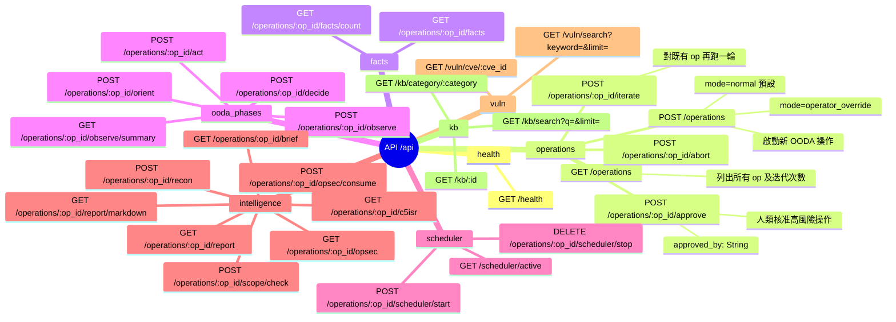
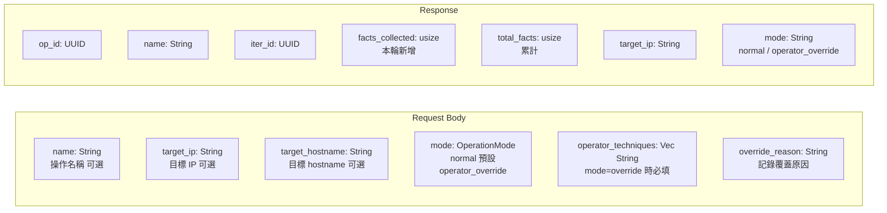
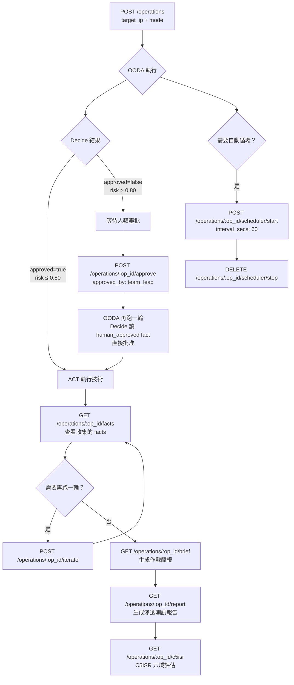

# Athena 2.0 — API 路由速查

> Base URL: `http://localhost:58000/api`

---

## 路由總覽



---

## POST /operations 完整參數



---

## 典型操作流程



---

## 認證

```
ATHENA_API_TOKEN 環境變數未設定 → 所有請求免認證
ATHENA_API_TOKEN=<token> 已設定 → 需帶 Authorization: Bearer <token>
/api/health 永遠免認證
```
