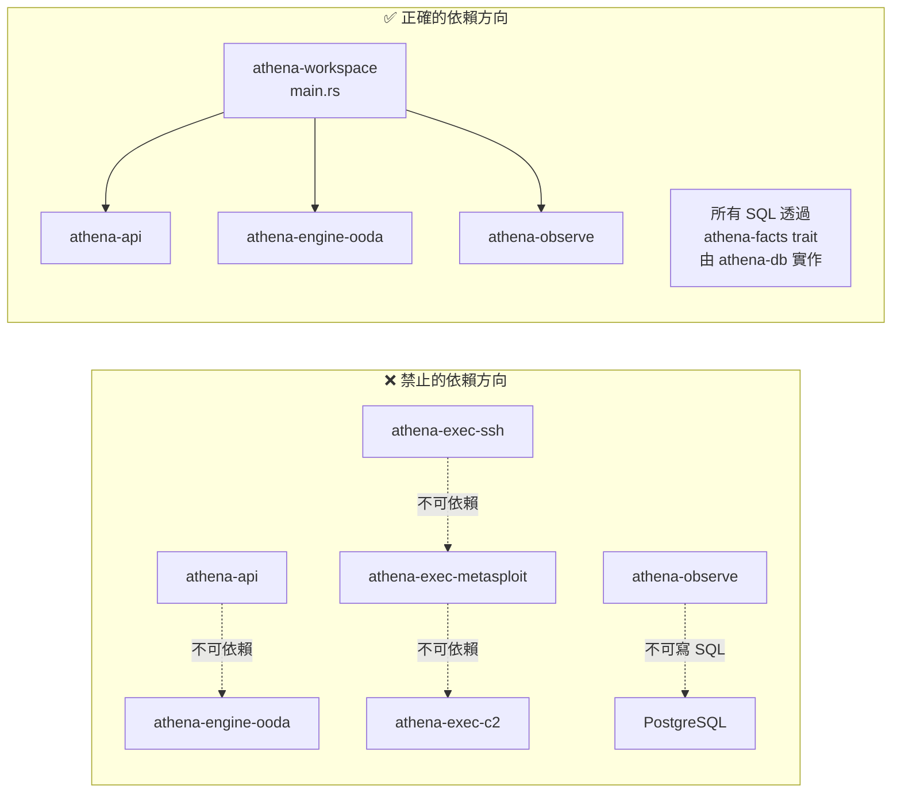
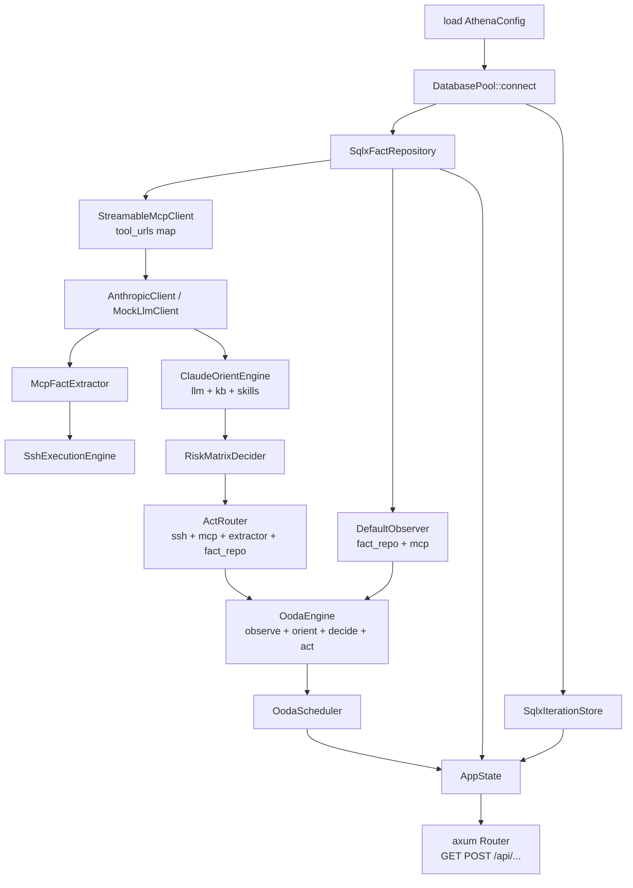
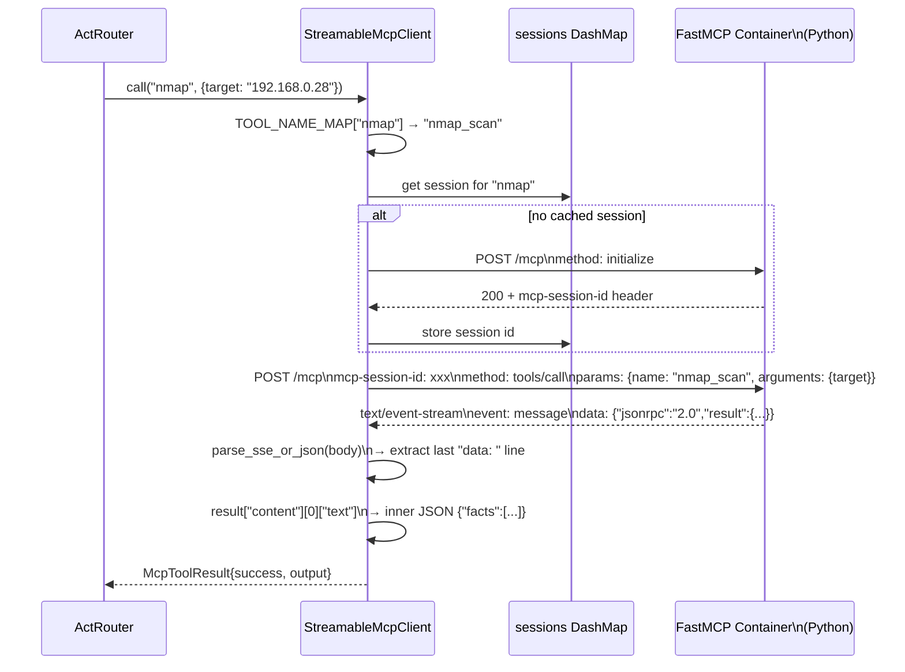
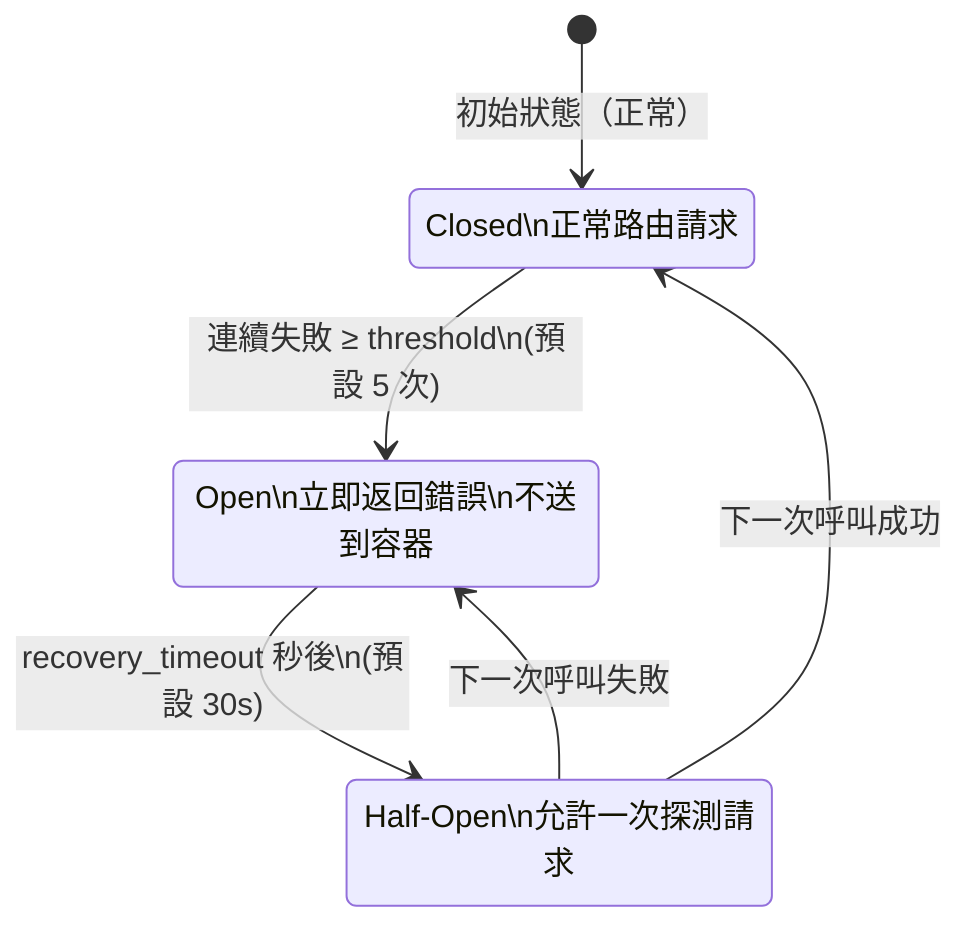

# Athena 2.0 — Crate 依賴圖與職責

> ADR-101 鐵律：執行引擎 crate 不得互相依賴；所有 SQL 只在 athena-db。

---

## 1. 完整 Crate 依賴圖

```mermaid
graph TD
    %% Foundation（零依賴層）
    subgraph foundation["Foundation（零依賴）"]
        TYPES[athena-types\n所有 domain struct + PhaseContext]
        TELEM[athena-telemetry\ntracing + Prometheus]
    end

    %% Infrastructure
    subgraph infra["Infrastructure"]
        CONFIG[athena-config\nfigment toml+env]
        DB[athena-db\nsqlx PostgreSQL migrations]
        EVENTS[athena-events\ntyped pub-sub EventBus]
    end

    %% Knowledge & Policy
    subgraph knowledge["Knowledge & Policy"]
        KNOW[athena-knowledge\nOperationalConstraints]
        POLICY[athena-policy\nRoE PolicyEngine]
        KB[athena-pentest-kb\nTantivyKnowledgeBase]
        SKILLS[athena-skills-loader\nFileSystemSkillsLoader]
        SCOPE[athena-scope\nCidrScopeValidator]
    end

    %% Client Layer
    subgraph clients["Clients"]
        LLM[athena-llm-client\nAnthropicClient MockLlmClient]
        MCP[athena-mcp-client\nStreamableMcpClient\ncircuit breaker]
        EXTRACTOR[athena-mcp-fact-extractor\nFastMCP → Fact]
    end

    %% OODA Phases
    subgraph phases["OODA Phases（Arc dyn Trait）"]
        OBS[athena-observe\nDefaultObserver\nObservePhase]
        ORI[athena-orient\nClaudeOrientEngine\nPassthroughOrient\nOrientPhase]
        DEC[athena-decide\nRiskMatrixDecider\nOperatorDirectDecider\nDecidePhase]
        ACT_LIB[athena-act\nActRouter\nActPhase]
    end

    %% Execution Engines
    subgraph exec["Execution Engines（互不依賴）"]
        SSH[athena-exec-ssh\nrussh SshExecutionEngine]
        META[athena-exec-metasploit\n2.1 stub]
        C2[athena-exec-c2\n2.1 stub]
        WINRM[athena-exec-winrm\n2.1 stub]
    end

    %% Intelligence
    subgraph intel["Intelligence"]
        ATTACK[athena-attack-graph\nDijkstraAttackGraph]
        OPSEC[athena-opsec\nInMemoryOpsecMonitor]
        C5ISR[athena-c5isr\nFactDrivenC5isrMapper]
        VULN[athena-vuln\nNvdClient]
        RECON[athena-recon\nMcpReconEngine]
        BRIEF[athena-brief\nFactBriefGenerator]
        REPORT[athena-report\nFactReportGenerator]
    end

    %% Core Engine
    ENGINE[athena-engine-ooda\nOodaEngine\nDecisionEngine trait]
    FACTS[athena-facts\nSqlxFactRepository\nSqlxIterationStore]
    SWARM[athena-swarm\nParallelSwarm]
    SCHED[athena-scheduler\nOodaScheduler]

    %% API & Binary
    API[athena-api\naxum router AppState]
    BIN[athena-workspace\nmain.rs DI wiring]

    %% Dependency edges
    TYPES --> CONFIG
    TYPES --> DB
    TYPES --> EVENTS
    TYPES --> KNOW
    TYPES --> POLICY
    TYPES --> KB
    TYPES --> SKILLS
    TYPES --> SCOPE
    TYPES --> LLM
    TYPES --> MCP
    TYPES --> EXTRACTOR
    TYPES --> OBS
    TYPES --> ORI
    TYPES --> DEC
    TYPES --> ACT_LIB
    TYPES --> SSH
    TYPES --> ATTACK
    TYPES --> OPSEC
    TYPES --> C5ISR
    TYPES --> VULN
    TYPES --> RECON
    TYPES --> BRIEF
    TYPES --> REPORT
    TYPES --> ENGINE
    TYPES --> FACTS
    TYPES --> SWARM
    TYPES --> SCHED
    TYPES --> API

    DB --> FACTS
    FACTS --> OBS
    FACTS --> C5ISR
    FACTS --> BRIEF
    FACTS --> REPORT
    FACTS --> API

    MCP --> OBS
    MCP --> ACT_LIB
    MCP --> RECON
    EXTRACTOR --> OBS
    EXTRACTOR --> ACT_LIB

    LLM --> ORI
    KB --> ORI
    SKILLS --> ORI
    KNOW --> DEC
    POLICY --> DEC
    SSH --> ACT_LIB
    ATTACK --> ENGINE
    OBS --> ENGINE
    ORI --> ENGINE
    DEC --> ENGINE
    ACT_LIB --> ENGINE
    ACT_LIB --> SWARM
    ENGINE --> SCHED
    ENGINE --> API
    FACTS --> API
    SCHED --> API
    SCOPE --> API
    OPSEC --> API
    C5ISR --> API
    VULN --> API
    KB --> API
    BRIEF --> API
    REPORT --> API
    RECON --> API
    EVENTS --> API
    API --> BIN
```

---

## 2. ADR-101 鐵律視覺化

---

## 3. main.rs DI Wiring 順序

---

## 4. MCP StreamableHTTP 協議流程

---

## 5. Circuit Breaker 狀態機

