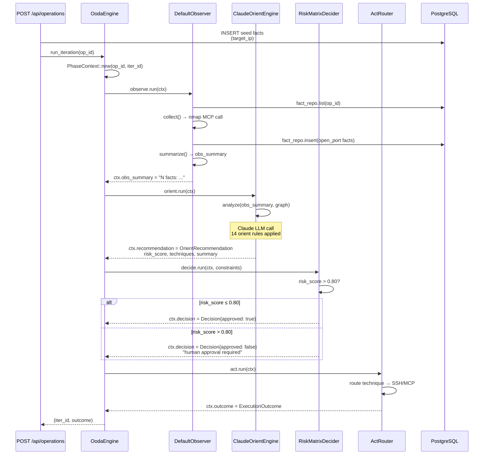
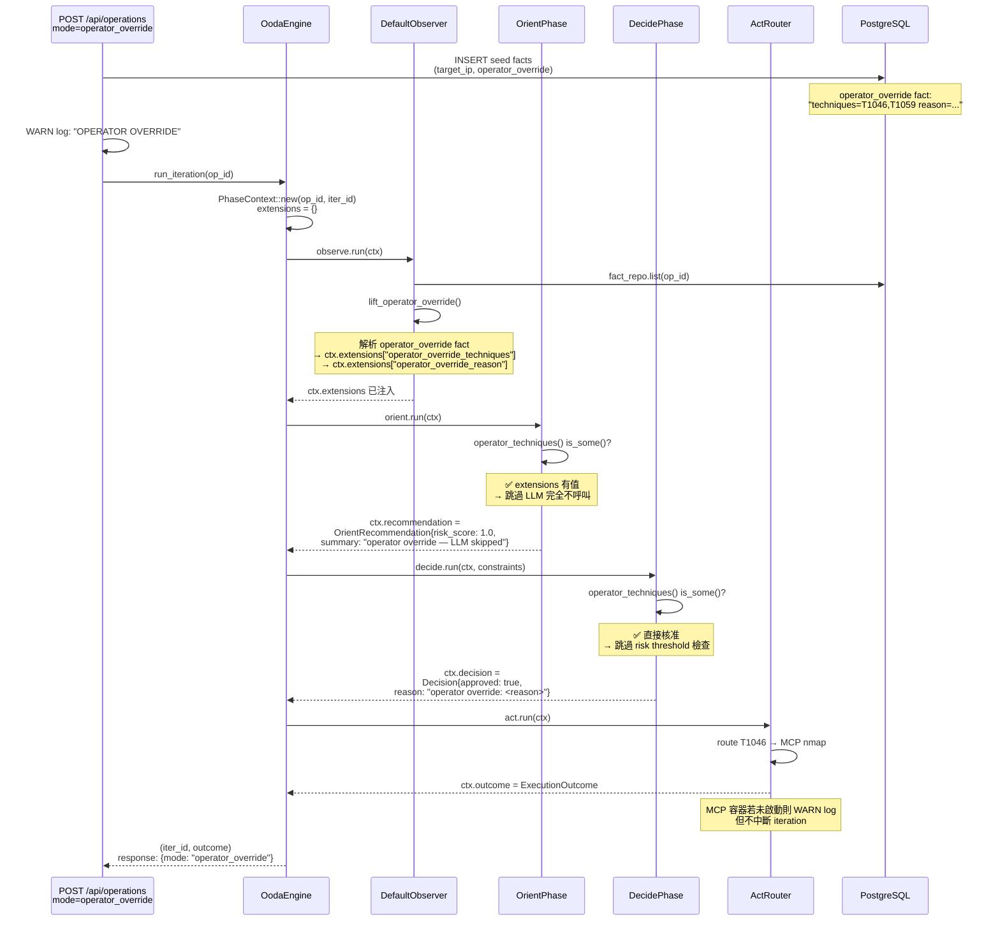
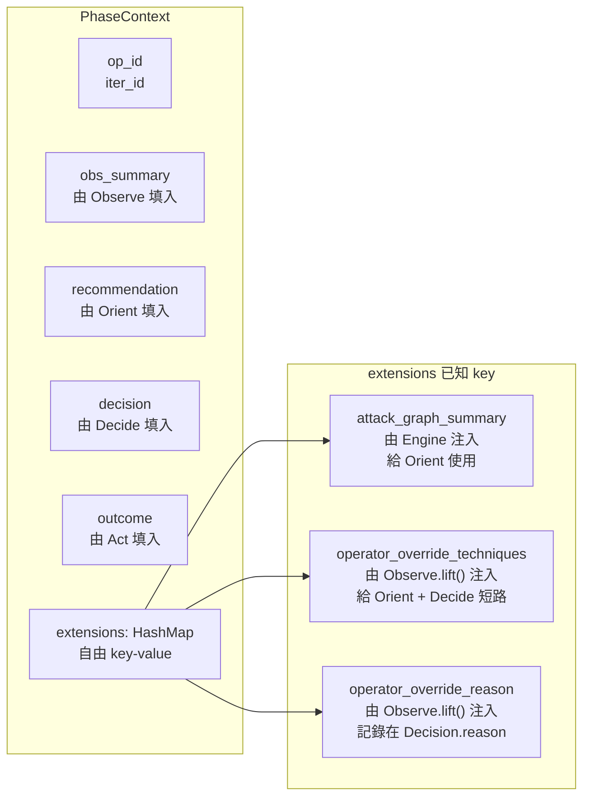
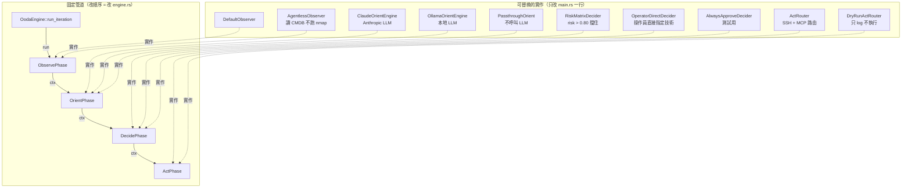
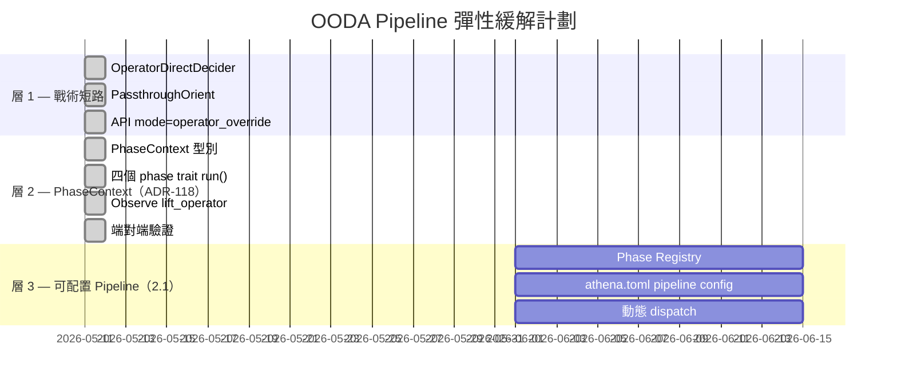

# OODA Pipeline — PhaseContext 資料流

> ADR-118 實作後的管道架構。所有圖以 Mermaid 語法撰寫，可在 GitHub、VSCode、Obsidian 直接渲染。

---

## 1. 正常模式（LLM 驅動）



---

## 2. Operator Override 模式（繞過 LLM 和 risk gate）



---

## 3. PhaseContext 結構與 extensions 傳遞路徑



---

## 4. 四個 Phase Trait 的熱插拔替換範圍



---

## 5. Operator Override API 呼叫範例

```bash
# 正常模式（LLM 驅動 + risk gate）
curl -X POST http://localhost:58000/api/operations \
  -H 'Content-Type: application/json' \
  -d '{
    "name": "recon-192.168.0.28",
    "target_ip": "192.168.0.28"
  }'

# Operator Override（risk 0.95 已人工批准，跳過 LLM）
curl -X POST http://localhost:58000/api/operations \
  -H 'Content-Type: application/json' \
  -d '{
    "name": "approved-attack",
    "target_ip": "192.168.0.28",
    "mode": "operator_override",
    "operator_techniques": ["T1046", "T1059.004"],
    "override_reason": "risk 0.95 approved by team lead 2026-05-11"
  }'
```

**Log 驗證點**（確認路徑正確）：

| Log 行 | 正常模式 | Override 模式 |
|--------|---------|--------------|
| `ORIENT: entering phase` | 接著呼叫 LLM | 直接短路 |
| `ORIENT complete summary=` | Claude 分析文字 | `"operator override — LLM skipped"` |
| `DECIDE complete approved=` | `true`/`false` 視 risk | 永遠 `true` |
| `DECIDE complete reason=` | `"Approved N technique(s)..."` | `"operator override: <reason>"` |

---

## 6. 三層緩解計劃執行狀態


