# SPEC-050：OODA↔C5ISR Mermaid Flow Visualization

> War Room 頁面以 Mermaid 即時流程圖視覺化 OODA↔C5ISR 雙向影響、AI 決策結果與行動結果。

| 欄位 | 內容 |
|------|------|
| **規格 ID** | SPEC-050 |
| **關聯 ADR** | ADR-040（C5ISR Reverse OODA Influence & OPSEC Monitoring） |
| **估算複雜度** | 高 |

---

## 🎯 目標（Goal）

> 在 War Room 前端以動態 Mermaid 流程圖即時呈現 OODA↔C5ISR 的雙向耦合關係，讓指揮官能直觀理解：當前 OODA phase、C5ISR 六域健康狀態、constraint 如何限制 AI 決策，以及行動結果如何回饋影響 domain health。

**為何用 Mermaid（而非 pure SVG）**：
- SPEC-026 針對 Kill Chain 靜態 7-node 圖選了 pure SVG（~0KB footprint）
- 本功能的流程圖結構是**動態的**（constraint 數量/類型隨 C5ISR health 變化），Mermaid 的宣告式語法更適合動態生成
- 透過自訂 theme 使 Mermaid 輸出完全符合 v2 設計語言

---

## 📥 輸入規格（Inputs）

| 參數名稱 | 型別 | 來源 | 限制條件 |
|----------|------|------|----------|
| dashboard | `OodaDashboard` | `GET /operations/{id}/ooda/dashboard` | currentPhase, iterationCount, latestIteration |
| domains | `C5ISRStatus[]` | `GET /operations/{id}/c5isr` | 6 domains，含 healthPct, status, domain |
| constraints | `OperationalConstraints` | `GET /operations/{id}/constraints` | warnings, hardLimits, orientMaxOptions, forcedMode 等 |
| c5isr.update | WebSocket event | `useWebSocket` subscribe | 即時 domain health 變化 |
| constraint.active | WebSocket event | `useWebSocket` subscribe | 即時 constraint 觸發/解除 |

**Polling 策略**：初始 fetch + 15 秒 interval（與現有 OODA polling 一致）

---

## 📤 輸出規格（Expected Output）

**成功情境 — 動態 Mermaid definition string**：

```mermaid
flowchart LR
  subgraph OODA["OODA Cycle #3"]
    direction TB
    OBS["OBSERVE\n(collection)"]
    ORI["ORIENT\n(2/3 options)"]
    DEC["DECIDE\n(min conf: 0.75)"]
    ACT["ACT\n(mode: RECOVERY)"]
    OBS --> ORI --> DEC --> ACT
    ACT -.->|"feedback"| OBS
  end

  subgraph C5ISR["C5ISR Domain Health"]
    direction TB
    CMD["CMD\n94% OK"]
    CTRL["CTRL\n91% OK"]
    COMMS["COMMS\n35% CRIT"]
    COMP["COMP\n88% OK"]
    CYBER["CYBER\n65% WARN"]
    ISR["ISR\n96% OK"]
  end

  subgraph CONSTR["Active Constraints"]
    direction TB
    HL0["forced: RECOVERY"]
    HL1["max_parallel: 1"]
  end

  COMMS -->|"health 35%"| HL0
  HL0 -->|"constrains"| ACT
  COMMS -->|"health 35%"| HL1
  HL1 -->|"constrains"| ACT

  ACT ==>|"results update\nhealth"| C5ISR

  classDef active stroke:#3b82f6,stroke-width:2px,fill:#111827
  classDef healthy stroke:#22C55E,fill:#111827
  classDef degraded stroke:#FBBF24,fill:#111827
  classDef critical stroke:#EF4444,fill:#111827

  class OBS active
  class CMD,CTRL,COMP,ISR healthy
  class CYBER degraded
  class COMMS critical
```

**動態邏輯**：
- OODA node labels 動態反映 constraint 影響（reduced options、min confidence、forced mode）
- C5ISR node labels 動態反映即時 health% 和分類符號
- Constraint subgraph 只在 `warnings.length > 0 || hardLimits.length > 0` 時出現
- 每個 constraint 產生 edge：`{domain} -->|"{healthPct}"| {constraintNode} -->|"constrains"| {oodaPhase}`
- 健康分類：≥80 = healthy(green)、50-79 = degraded(yellow)、<50 = critical(red)

**失敗情境**：

| 錯誤類型 | 處理方式 |
|----------|----------|
| 無 OODA dashboard | 顯示 "Waiting for OODA data..." placeholder |
| Mermaid parse error | 顯示紅色邊框 error UI + 錯誤訊息 |
| API 404 | useC5ISRData hook 靜默處理，domains 為空陣列 |
| WebSocket 斷線 | 降級為 15s polling only |

---

## 🔗 副作用與連動（Side Effects）

| 本功能的狀態變動 | 受影響的既有功能 | 預期行為 |
|-----------------|----------------|---------|
| Override 按鈕 → `POST /constraints/override` | Constraint Engine（後端） | 單輪 cycle 解除指定 domain constraint |
| Override 成功 | useC5ISRData hook | 立即 refetch constraints + domains |
| WebSocket `c5isr.update` | Mermaid diagram + Health Grid | 即時 re-render，無需手動刷新 |
| WebSocket `constraint.active` | Mermaid diagram + Constraint Panel + Banner | 即時顯示/隱藏 constraint subgraph |

---

## ⚠️ 邊界條件（Edge Cases）

- Case 1：**無 OODA iteration**（operation 剛建立）→ 顯示 placeholder，不渲染 Mermaid
- Case 2：**所有 domain healthy**（無 constraint）→ 隱藏 constraint subgraph，只顯示 OODA↔C5ISR 雙向 feedback
- Case 3：**多個 domain 同時 critical**→ 多個 constraint nodes + edges，Mermaid auto-layout
- Case 4：**domain healthPct = 0**→ 分類為 critical，顯示 "CRIT" 符號
- Case 5：**Mermaid definition 語法錯誤**→ MermaidRenderer 顯示紅色邊框 error panel
- Case 6：**Override 過期（10 分鐘後）**→ 下次 polling 自動恢復 constraint 狀態

### 回退方案（Rollback Plan）

- **回退方式**：revert commit（純前端新增，無 DB migration）
- **不可逆評估**：完全可逆，無 DB schema 變更，無外部通知
- **資料影響**：無。後端 API 不受前端回退影響
- **依賴回退**：移除 `mermaid` npm dependency（package.json restore）

---

## ✅ 驗收標準（Done When）

- [x] `buildOODAC5ISRFlow()` pure function 通過 12 項單元測試
- [x] MermaidRenderer 使用 v2 theme（`#0a0e17` bg、`#111827` nodes、`#3b82f6` accent）
- [x] War Room 從 2-column 改為 3-column layout（OODA Panel / Center / Action Log）
- [x] `useC5ISRData` hook 結合 API polling（15s）+ WebSocket 即時更新
- [x] ConstraintBanner 在 `hardLimits.length > 0` 時顯示於頂部
- [x] ConstraintStatusPanel 顯示 4 指標（Forced Mode、Noise Budget、Max Options、Blocked Targets）+ override 按鈕
- [x] C5ISRHealthGrid 3×2 domain cards 顯示 health%、status badge
- [x] C5ISRDomainDetail 點擊展開完整 domain report
- [x] i18n 支援 en + zh-TW（Constraints namespace）
- [x] `make lint` 無 error
- [x] 210/210 前端測試通過（含 12 項 buildFlowDefinition 測試）
- [x] Design mockup 完成（`design/pencil-new-v2.pen` → "War Room" frame）

---

## 🔗 追溯性（Traceability）

| 實作檔案 | 測試檔案 | 最後驗證日期 |
|----------|----------|-------------|
| `frontend/src/lib/buildFlowDefinition.ts` | `frontend/src/components/c5isr/__tests__/buildFlowDefinition.test.ts` | 2026-03-13 |
| `frontend/src/lib/mermaidTheme.ts` | — | 2026-03-13 |
| `frontend/src/components/c5isr/MermaidRenderer.tsx` | — | 2026-03-13 |
| `frontend/src/components/c5isr/OODAFlowDiagram.tsx` | — | 2026-03-13 |
| `frontend/src/components/c5isr/C5ISRDomainCard.tsx` | — | 2026-03-13 |
| `frontend/src/components/c5isr/C5ISRHealthGrid.tsx` | — | 2026-03-13 |
| `frontend/src/components/c5isr/ConstraintStatusPanel.tsx` | — | 2026-03-13 |
| `frontend/src/components/c5isr/C5ISRDomainDetail.tsx` | — | 2026-03-13 |
| `frontend/src/hooks/useC5ISRData.ts` | — | 2026-03-13 |
| `frontend/src/types/constraint.ts` | — | 2026-03-13 |
| `frontend/src/app/warroom/page.tsx` | — | 2026-03-13 |
| `frontend/messages/en.json` | `frontend/src/test/i18n-schema.test.ts` | 2026-03-13 |
| `frontend/messages/zh-TW.json` | `frontend/src/test/i18n-schema.test.ts` | 2026-03-13 |

---

## 🚫 禁止事項（Out of Scope）

- 不要修改：OODA 後端邏輯（已在 SPEC-007 完成）
- 不要修改：Constraint Engine 後端邏輯（已在 SPEC-047 完成）
- 不要修改：Kill Chain 視覺化（已在 SPEC-026 完成，使用 pure SVG）
- 不要引入新依賴：除 `mermaid`（~280KB gzip）外不引入其他視覺化套件

---

## 📎 參考資料（References）

- **ADR-040**：C5ISR Reverse OODA Influence & OPSEC Monitoring Architecture
- **SPEC-047**：C5ISR Restructure & Constraint Engine（後端 constraint 實作）
- **SPEC-007**：OODA Loop Engine（後端 OODA 實作）
- **SPEC-026**：Attack Situation Diagram（記錄 Mermaid vs SVG 架構選擇）
- **Design mockup**：`design/pencil-new-v2.pen` → "War Room" frame（3-column + Mermaid flow）
